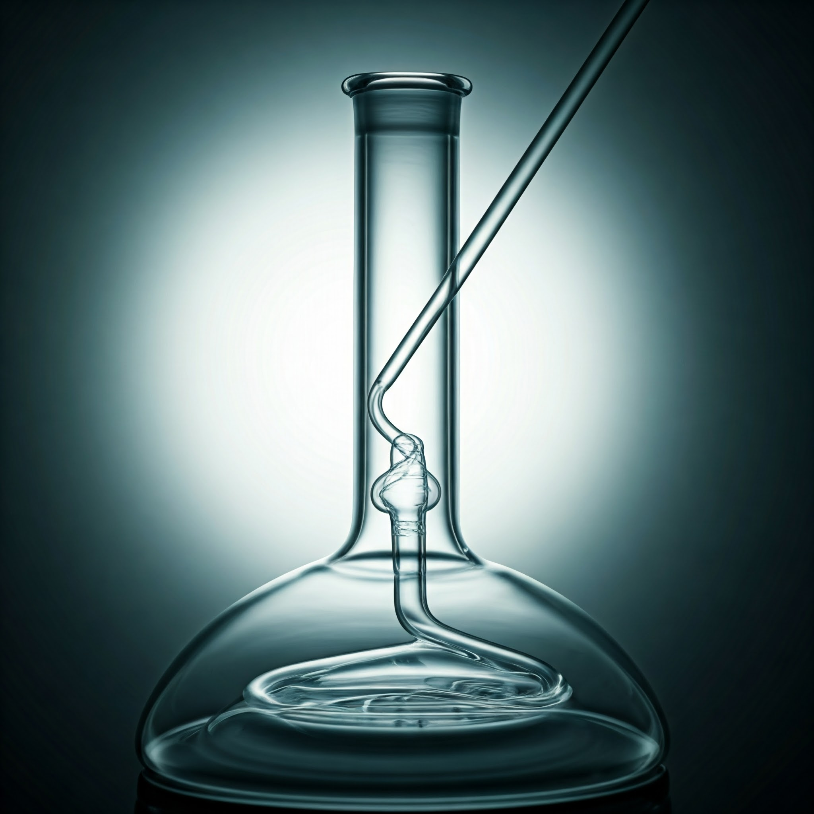

# Process Engineering Terms

## Flash distillation

### Description

Flash distillation is a separation process designed to separate a mixture of two or more components based on their **differences** in **boiling** points.

### Working procedure

**Ideally**: This is a continuous, single-stage (*mostly*) operation. There is no heat transfer inside the flasher (separator).

A liquid is heated to a specific pressure and temperature (through a HX or a furnace).

Then, a pressure reducing valve (PRV) reduces the pressures of the mixture. There will be a mixture of liquid and vapor phases.

Finally, it is introduced into the flasher where the vapor is fed typically to a condenser and the liquid is collected at the bottom. This is not perfect, the more volatile phase (lower boiling point) will be present in the liquid phase but in lower percentages, and vice-versa. 

  
### Variation

It is also possible to fix the pressure and increase the temperature of the liquid into the liquid-vapor phase.

# Important chemical molecules

## Sulfuric acid

Sulfuric Acid $$ H_2 SO_4 $$ is an acid which is corrosive, oily in nature. It is also hygroscopic and an oxidizing agent. As such, it may be used for example for carbonization of wood (i.e. removing water content).
