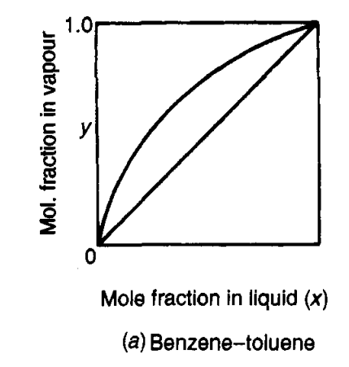
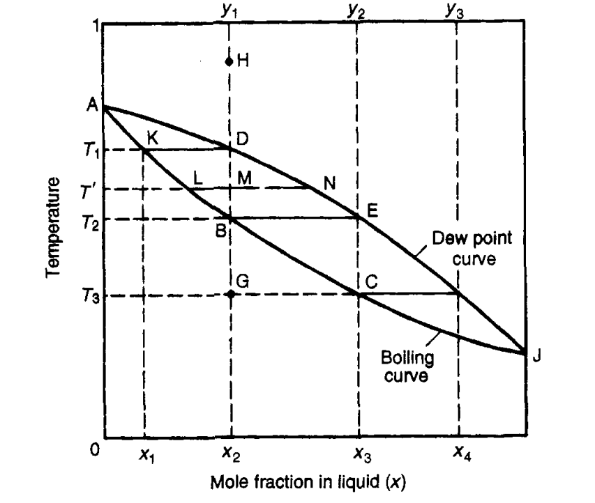

# Table of contents  

# Distillation

Distillation is the separation of a liquid mixture into its various components.

## Phase (Temperature composition) diagram

### Description

Imagine a mixture of two liquids. Say, for example, *Benzene-Toluene*. See info about this mixture [here](https://theengblog.vercel.app/post/processengineeringterms#benzene-toluene-mixture)

Let's list the boiling points:
- Benzene ($ C_6 H_6 $): 80.1°C
- Toluene ($ C_7 H_8 $): 110.6°C

Now, if we had pure Benzene (*call it A*), then the mixture would boil at $ T_A $. Similarly for pure Toluene, it would boil at $ T_B $.

Any mixture of $ x_A $ component of A and $ x_B $ component of B would boil at a temperature in this range ($ T_A <= T <= T_B $).

As such, it is very convenient to plot the phase diagram of this composition, which shows the boiling point (called the **vapor curve**) of this mixture as a function of the composition.

Also, note that A is the less volatile substance and B is the more volatile substance, as it evaporates sooner.



### Distillation through phase diagram

A mixture which undergoes distillation will experience various forms both in liquid composition and in vapor composition. We can best see, and plot these, via the phase diagram.



Let's say that our liquid starts at composition $ x=x_2 $. At point G, it will consist only of the liquid mixture. As it is heated to $ T=T_2 $, or point B, some part of that mixture will start to boil.

Heat it to point M, and we've got a liquid as well as a vapor mixture, each with its own composition.

- Firstly, the L-V composition proportions can be determined via the $ \frac{LM}{LN} $ and $ \frac{MN}{LN} $ proportions.

- Secondly, the compositions of each of these phases can be found via extending the vertical lines through points L and N.

- Finally, a complete evaporation will lead (*conservation of matter*) to the same composition, albeit in vapor phase. This can be seen at $ T = T_1 $ and a vapor composition of $ x = y_1 $ of substance A.

### Purity

Note that simply heating the liquid more and more, and subsequently causing more evaporation, will completely evaporate the entire mixture, which does not help with the distillation process.

What we want, is more of B and less of A in vapor form. As you can see, the maximum purity can be reached directly after the boiling starts, with a vapor composition of $ x = y_2 $ (or point E). However, there is hardly any vapor here, hence less of the distilled material.

Heating the mixture to a higher temperature results in less fine of a mixture, with higher vapor production.
So there is a balance to be achieved through tuning each of these factors.

## Partial Pressure and composition laws

Each component of a mixture of vapors exerts a "partial" pressure which is defined as the *the same pressure it would exert if it occupied the same volume as the mixture and at the same temperature.*

**Dalton's law** states that the total pressure is the sum of all the partial pressures:

$$
    P = \sum{P_i}
$$

But, for an ideal gas, the pressure of each gas is proportional to its molar fraction:

$$
    P_i = y_i * P
$$

Also, an ideal mixture is one where there is uniform mixing of all components, and where each gas behaves independently, following Dalton's law.
For such a mixture, we can apply Raoult's law:

$$
    P_i = x_i * P_i^*
$$

where $ P_i^* $ is the vapor pressure of that component at the given temperature.

Also note, that Raoult's law is replaced by Henry's constant for very low or very high $ x_i $. Since we are rarely interested in those values, this won't be discussed further.

## Examples and exercices

*Please consult Coulson's and Richardson Chemical Engineering Volume 2, chapter 11, pages 548-552.*

I will provide only one example.

The vapour pressures of n-heptane and toluene at 373 K are 106 and 73.7 kN/m2 respectively.
What are the mole fractions of n-heptane in the vapour and in the liquid phase at 373 K if the total
pressure is 101.3 kN/m2?

```matlab
syms x;
eqn = x*106 + (1-x)*73.7 == 101.3;
sol = solve(eqn, x);
x_sol = sol * 106 / 101.3; 

fprintf("The molar fraction in vapor phase is :")
disp(double(sol))
fprintf("The molar fraction in liquid phase is :")
disp(double(x_sol))

```

## Relative volatility

The volatility of a component in a mixture is defined as $ P_a / x_a $. Thus, the relative volatility $ \alpha $ is :

$$
 \alpha = \frac{P_a * x_b}{P_b * x_a}
$$

A simple rearrangement with Dalton's law gives:

$$
 y_a / y_b = \alpha * \frac{x_a}{x_b}
$$

Intuitively, the higher the relative volatility, the higher the distillation purity. Indeed, for an ideal mixture:

$$
\alpha = \frac{P_a^*}{P_b^*}
$$

# Distillation types

## Differential distillation

### Code

The code used to simulate a differential distillation for an ideal mixture and with constant relative volatility is as follows:

```matlab
% plotting differential distillation
function y = plotDiff(x0,x,S0,a, graphColor)
    % Default graph color if not provided
    if nargin < 5
        graphColor = [0 1 0];  % Green color
    end
    i = linspace(x0, x, 1000);
    k = log((1-x0)./(1-i));
    j = log(i.*(1-x0)./(x0.*(1-i)));
    l = (1/(a-1)).*j+k;
    y = S0 * exp(l);
    hold on;
    plot(i,y, "Color",graphColor);
    title("Final element moles in terms of starting composition");
end
```

### Results


Red:plotDiff(0.8,0.1,10,10,[1 0 0]);
Green:plotDiff(0.8,0.1,10,3);