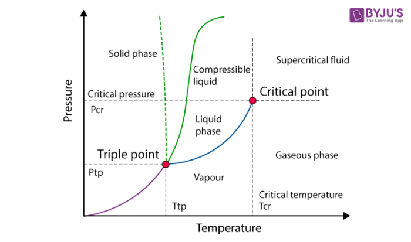

# Table of contents  

Throughout all these exercices, we'll also focus on using Matlab to automate the calculations whenever needed. We'll also use CoolProp, an actually cool thermodynamics library used to obtain data.

# Molar gas constant

**Problem**: Calculate the molar gas constant R in the following units:
a. (atm)(cm3)/(g ⋅ mol)(K)
b. (Pa)(m3)/(Kg ⋅ mol)(°K)

We'll calculate the properties at standard conditions.
Using the perfect gas law:

$$ 
    PV = RT
$$

```matlab
% Calculating gas constant at different units

format longG

%% Getting the facts straight
u = symunit;

Pressure = 101300 * u.Pa;
Temperature = 273.13 * u.kelvin;

%
density = py.CoolProp.CoolProp.PropsSI("D", "P", vval(separateUnits(Pressure)), "T", vval(Temperature), "air") * u.kg/(u.m^3);
molar_mass = py.CoolProp.CoolProp.PropsSI("molar_mass", "P", vval(Pressure), "T", vval(Temperature), "air") * u.kg / u.mol;

R = Pressure * molar_mass / (density * Temperature);

fprintf("At %s @ %s : \n", sval(Pressure), sval(Temperature));
fprintf("- Density: %s\n", sval(density));
fprintf("- Molar Mass: %s\n", sval(molar_mass));
fprintf("** Gas constant %s\n", sval(R));

%% Converting to different units:
% (atm)(cm3)/(g ⋅ mol)(K)
% (psia)(ft3)/(lb ⋅ mol)(°R)
units = [
    u.atm*u.cm^3 u.gram*u.kelvin*u.mol
    ];
for i= 1:size(units, 1)
    fprintf("** Gas constant %s\n", sval(unitConvert(R, units(i, 1) / units(i, 2))));
end

```

# Estimation of critical temperature

## Critical pressure and temperature

The critical temperature is the temperature from which the substance can't be liquefied no matter how much pressure is applied.

The critical pressure is the pressure at and above which the liquid and gas can't coexist at any temperature. It is also the pressure to turn the gas at critical temperature to a supercritical fluid.


*From [BIJUS](https://byjus.com/chemistry/critical-temperature/)*

## Supercritical fluid

The supercritical fluid has different properties than the liquid phase:

| **Property**         | **Liquid**                 | **Supercritical Fluid**                     |
|-----------------------|---------------------------|---------------------------------------------|
| **Density**           | High, relatively fixed    | Variable (between gas and liquid)           |
| **Phase boundary**    | Clear boundary present    | No distinct phase boundary                  |
| **Compressibility**   | Low                      | High                                        |
| **Flow behavior**     | Viscous                  | Flows easily like a gas                     |
| **Solvent ability**   | Good                     | Tunable, can act like a liquid or a gas     |


## The correlation

We can estimate the critical temperature using the Nokay'ss empirical relationship:

$$
    log(T_c) = A + B*log(SG) + C*log(T_b)
$$

Where:

$$ T_c $$ is the critical temperature (Kelvins) 

$$ T_b $$ is the normal boiling point (Kelvins)

$$ SG $$ is the Specific Gravity of liquid hydrocarbons at 60 F relative to water at same temperature.

$$A,B,C$$ are correlation constants given for each family of compounds. Please review these at the table provided by Nokay (1993).

## Using matlab

Let's create a function in matlab which calculates the critical temperature using the Nokay's equation:

```matlab
function Tc= NokayCriticalTemperature(A,B,C, SG, Tb)
    %example: NokayCriticalTemperature(1.359, 0.4369, 0.5622, 0.75, 617)
    Tc=A+B*log10(SG)+C*log10(Tb);
    Tc=power(10, Tc);
end
```

### Example: Calculation for Benzene

Benzene $ C_6 H_6 $ is an example of an aromatic, we can then use the constants given by the table to calculate the critical temperature:

```matlab
NokayCriticalTemperature(1.057, 0.22732, 0.669286, 0.885, 353.3)

ans =

  562.8284
```

# Appendices

## CoolProp Properties

### **Thermodynamic Properties in CoolProp**

| **Symbol**       | **Property**                     | **Units**                  |
|-------------------|----------------------------------|----------------------------|
| `T`              | Temperature                      | K                          |
| `P`              | Pressure                         | Pa                         |
| `D` or `rho`     | Density                          | kg/m³                      |
| `H`              | Enthalpy                         | J/kg                       |
| `S`              | Entropy                          | J/(kg·K)                   |
| `U`              | Internal Energy                  | J/kg                       |
| `Q`              | Vapor Quality (Mass Fraction)    | Unitless (0 to 1)          |
| `A`              | Speed of Sound                   | m/s                        |
| `Z`              | Compressibility Factor           | Unitless                   |
| `C`              | Isochoric Specific Heat Capacity | J/(kg·K)                   |
| `Cp`             | Isobaric Specific Heat Capacity  | J/(kg·K)                   |
| `Cv`             | Isochoric Specific Heat Capacity | J/(kg·K)                   |
| `I`              | Surface Tension                 | N/m                        |
| `conductivity`   | Thermal Conductivity             | W/(m·K)                    |
| `viscosity`      | Dynamic Viscosity               | Pa·s                       |
| `molar_mass`     | Molar Mass                      | kg/mol                     |
| `Prandtl`        | Prandtl Number                  | Unitless                   |
| `phase`          | Phase Identifier                | String (e.g., "liquid")    |

## Helper functions

### sval
The function `sval` converts a symunit expression into its representative string:
```matlab
function res = sval(expression)
    % Converting an symunit expression into a string
    [data, uunit] = separateUnits(expression);
    res = sprintf("*%.2f %s*", double(vpa(data)), symunit2str(uunit));
end
```

### vval
The function `vval` extracts the value from symval.

```matlab
function res = vval(expression)
    % Get the numerical value without units
    res = double(separateUnits(expression));
end
```